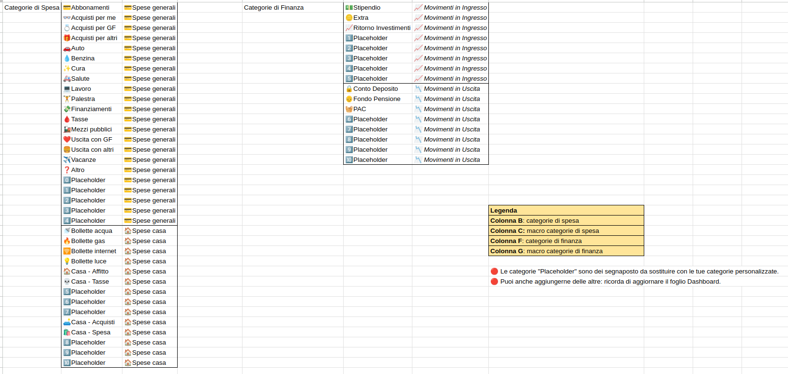
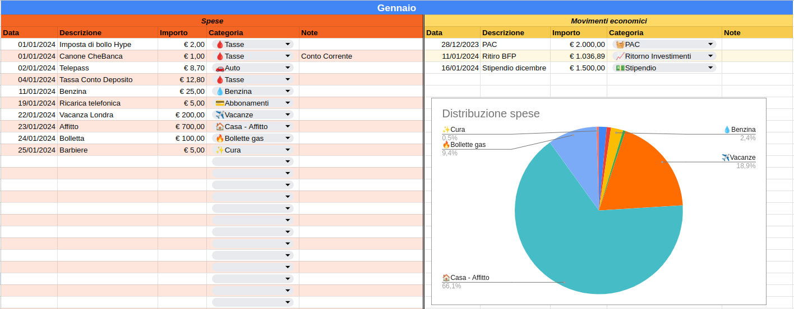
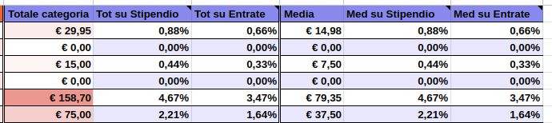
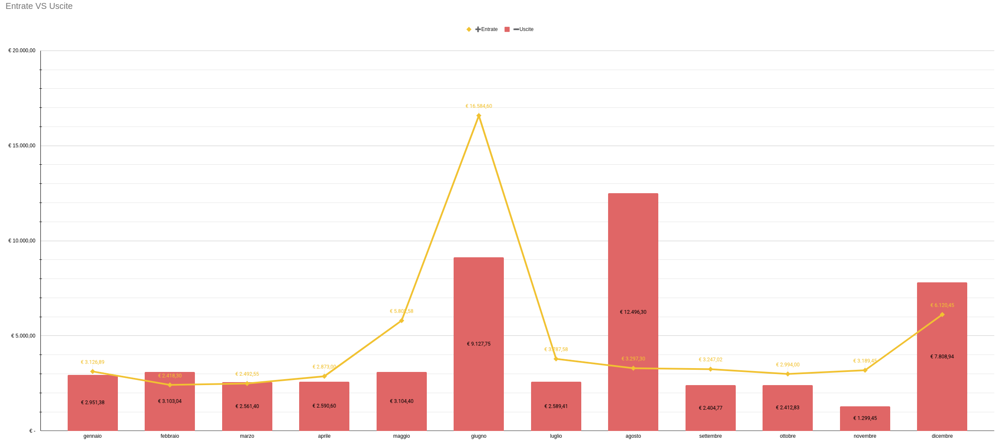
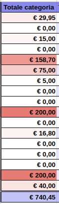
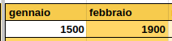
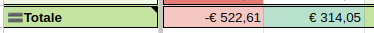

# Simple Budget Tracker
Simple Budget Tracker (SBT) è un'app per tracciare le spese in modo da capire come vengono spesi i propri soldi e di conseguenza regolare il proprio stile di vita per rientrare negli obbiettivi preposti.

Si presenta sotto forma di template di foglio di calcolo; può essere scaricato ed importato su Google Spreadsheet / Microsoft Excel / Calc.

È un progetto nato nel 2023 per esigenze personali e costantemente migliorato fino alla versione odierna.

## Download
Link all'ultima versione ([2025](https://docs.google.com/spreadsheets/d/1gL7TU-lOzGZdLt5lJcIb-8qSYUKdcPM1m_zXO5WN53o/edit?usp=sharing)).

Per utilizzarlo clicca su `File` > `Crea una copia`.

## Funzionalità

### Personalizzazione di tutte le categorie

### Inserimento valori
- Inserimento spese
- Inserimento entrate economiche
- Inserimento investimenti / salvadanai / accantonamenti

### Statistiche
- Statistiche mensili su totale e media spese
- Statistiche mensili su totale entrate e uscite
- Statistiche mensili su percentuali di ciascuna categoria rispetto allo stipendio e a tutte le entrate
- Statistiche mensili sugli obiettivi raggiunti o meno
- Grafici per analisi dei dati

### Heatmaps
#### Le spese più grandi sono in evidenza

#### I guadagni più grandi sono in evidenza

#### I totali indicano se si è in positivo (verde) o in negativo (rosso)

## Versioni

### v2.0 (2025)
Link di accesso: [link](https://docs.google.com/spreadsheets/d/1gL7TU-lOzGZdLt5lJcIb-8qSYUKdcPM1m_zXO5WN53o/edit?usp=sharing)

Novità:
- Aggiunta gestione delle spese legate alla casa
- Aggiunte informazioni aggiuntive in dashboard (casa, statistiche, heatmaps)
- Tredicesima mensilità non più esplicita

### v1.0 (2024)
Link di accesso: [link](https://docs.google.com/spreadsheets/d/1pQCYOj4yHN6Sh8pvnGRuUnHgS-XL-s3KXktxWbsPcoY/edit?usp=sharing)

Versione base

### Upgrade
L'approccio più semplice e sicuro da seguire è quello di scaricare il nuovo template, modificare le categorie di spesa e procedere con il fare copia e incolla massivo delle spese per ogni mese

## FAQ

### Perchè fare budgeting
Segnare le spese è la base della Finanza Personale. È importante conoscere come vengono spesi i nostri soldi prima di poter stabilire dove risparmiare e come investire.

### Devo segnare tutte le spese?
No, puoi scegliere di tracciare soltanto le spese che ti interessano.

Questo approccio però è sconsigliato: selezionando solo alcune tipologie di informazioni può capitare che il valore di alcune statistiche si discosti da quello reale; ad esempio il totale delle entrate o il totale delle spese risulterebbero più bassi dei valori reali.

Un'alternativa è quella di semplificare il tutto utilizzando categorie più generiche e far confluire lì le spese che non si vogliono tracciare. Ad esempio si può inserire la categoria "_Bollette_" invece di specificare individualmente "_Bolletta acqua_", "_Bolletta gas_", "_Bolletta internet_" e "_Bolletta luce_", oppure utilizzare direttamente la categoria "_Altro_".

### Perchè scegliere Simple Budget Tracker?
SBT offre i seguenti vantaggi:
- **Offline**: puoi usarlo senza una connessione ad internet in quanto non ha bisogno di elaborazioni lato server
- **Backup automatico** su piattaforme come Google Drive, Google Spreadsheet, One Drive e sulle proprie piattaforme in cloud
- **Multipiattaforma**: puoi aprire il foglio di calcolo da qualsiasi dispositivo
- **Personalizzabile**: il template è pensato per essere estendibile e facilmente personalizzabile in modo da adattarsi alle tue esigenze
- **Privacy oriented**: i dati restano sempre in tuo possesso nella modalità offline

### Come posso contribuire?
Rispetto alla scrittura di codice è più difficile collaborare su uno stesso foglio di calcolo. Per idee, proposte e segnalazioni apri pure una issue!
