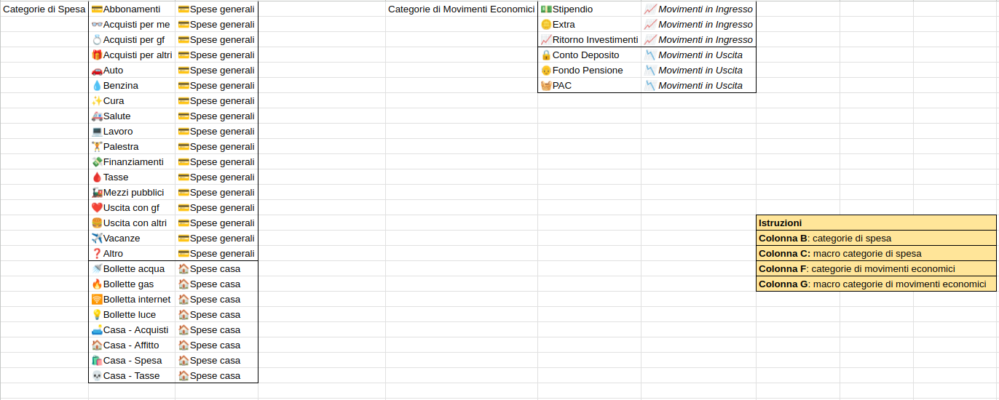

# Simple Budget Tracker
Simple Budget Tracker (SBT) è un'app per tracciare le spese in modo da analizzare come vengono spesi i propri soldi e di conseguenza regolare il proprio stile di vita per rientrare negli obbiettivi preposti.

Si presenta sotto forma di template di foglio di calcolo; può essere scaricato ed importato su Google Spreadsheet (compatibile al 100%) oppure su Microsoft Excel / Calc e simili.

È un progetto nato nel 2023 per esigenze personali e costantemente migliorato fino alla versione odierna.

## Indice

- [Simple Budget Tracker](#simple-budget-tracker)
  - [Indice](#indice)
  - [Download](#download)
  - [Funzionalità](#funzionalità)
    - [Spese](#spese)
    - [Movimenti finanziari, Risparmi, Statistiche](#movimenti-finanziari-risparmi-statistiche)
    - [Personalizzazione di tutte le categorie](#personalizzazione-di-tutte-le-categorie)
    - [Inserimento valori](#inserimento-valori)
    - [Statistiche](#statistiche)
    - [Heatmaps](#heatmaps)
      - [Le spese più grandi sono in evidenza](#le-spese-più-grandi-sono-in-evidenza)
      - [I guadagni più grandi sono in evidenza](#i-guadagni-più-grandi-sono-in-evidenza)
      - [I totali indicano se si è in positivo (verde) o in negativo (rosso)](#i-totali-indicano-se-si-è-in-positivo-verde-o-in-negativo-rosso)
    - [Raggruppamenti](#raggruppamenti)
      - [Raggruppamenti per categoria](#raggruppamenti-per-categoria)
      - [Raggruppamenti per data](#raggruppamenti-per-data)
    - [Altro](#altro)
  - [Versioni](#versioni)
    - [v3 (2026)](#v3-2026)
    - [v2.1 (2025)](#v21-2025)
    - [v2.0 (2025)](#v20-2025)
    - [v1.0 (2024)](#v10-2024)
    - [Upgrade](#upgrade)
  - [FAQ](#faq)
    - [Perchè fare budgeting](#perchè-fare-budgeting)
    - [Devo segnare tutte le spese?](#devo-segnare-tutte-le-spese)
    - [Perchè scegliere Simple Budget Tracker?](#perchè-scegliere-simple-budget-tracker)
    - [Come posso contribuire?](#come-posso-contribuire)

## Download
Link all'ultima versione ([2025 v2](https://docs.google.com/spreadsheets/d/1XqJC59epEV-zMwRt0qCgaM_BXF0edMsaPJfv8e_dtzo/edit?usp=sharing)).

Per utilizzarlo clicca su `File` > `Crea una copia`.

Per rimanere sempre aggiornato metti una stella al progetto :star:

## Funzionalità
### Spese

### Movimenti finanziari, Risparmi, Statistiche

### Personalizzazione di tutte le categorie
- Segnaposto (Placeholder) già inseriti per una rapida sostituzione
- Categorie personalizzate illimitate

### Inserimento valori
- Inserimento spese
- Inserimento entrate economiche
- Inserimento investimenti / salvadanai / accantonamenti
- Grafico con distribuzione mensile delle spese

### Statistiche
- Statistiche mensili su totale e media delle spese
- Statistiche mensili su totale di entrate e uscite
- Statistiche mensili su percentuali di ciascuna categoria rispetto allo stipendio e a tutte le entrate complessive
- Statistiche mensili sugli obiettivi raggiunti o meno
- Grafici per analisi dei dati

### Heatmaps
#### Le spese più grandi sono in evidenza

#### I guadagni più grandi sono in evidenza

#### I totali indicano se si è in positivo (verde) o in negativo (rosso)

### Raggruppamenti
Spese e Movimenti Finanziari possono essere raggruppati, con una vista che mostra somme parziali e conteggi in ciascun gruppo.

#### Raggruppamenti per categoria

#### Raggruppamenti per data

### Altro
- La dashboard si riempie man mano che i mesi passano, in modo da risultare sempre pulita
- Le tabelle si estendono automaticamente con l'inserimento di nuovi valori

## Versioni

### v3 (2026)
Link di accesso: [link](https://docs.google.com/spreadsheets/d/1o_XW2RBx7V8slcOufcDuwUPcTTfnzAA0o5rmI6A--R0/edit?usp=sharing)

Novità:
- Aggiunta di un calendario con i mesi trascorsi
- Utilizzo delle tabelle native
- Velocizzazione performance generali utilizzando fogli di dimensioni ridotte in partenza
- (Fix) visualizzazione per intero dei template di anni precedenti (indipendentemente dal mese)

### v2.1 (2025)
Link di accesso: [link](https://docs.google.com/spreadsheets/d/1XqJC59epEV-zMwRt0qCgaM_BXF0edMsaPJfv8e_dtzo/edit?usp=sharing)

Novità:
- Miglioramento performance
  - Utilizzo degli intervalli denominati (named ranges)
  - Limitata la lunghezza delle colonne per la convalida dei dati (max 50, espandibile)
- Uniformato stile degli sheet mensili

### v2.0 (2025)
Link di accesso: [link](https://docs.google.com/spreadsheets/d/1gL7TU-lOzGZdLt5lJcIb-8qSYUKdcPM1m_zXO5WN53o/edit?usp=sharing)

Novità:
- Aggiunta gestione delle spese legate alla casa
- Aggiunte informazioni aggiuntive in dashboard (casa, statistiche, heatmaps)
- Tredicesima mensilità non più esplicita

### v1.0 (2024)
Link di accesso: [link](https://docs.google.com/spreadsheets/d/1pQCYOj4yHN6Sh8pvnGRuUnHgS-XL-s3KXktxWbsPcoY/edit?usp=sharing)

Versione base

### Upgrade
L'approccio più semplice e sicuro da seguire è quello di scaricare il nuovo template, modificare le categorie di spesa e procedere con il fare copia e incolla massivo delle spese per ogni mese

## FAQ

### Perchè fare budgeting
Segnare le spese è la base della Finanza Personale. È importante conoscere come vengono spesi i nostri soldi prima di poter stabilire dove risparmiare e come investire.

### Devo segnare tutte le spese?
No, puoi scegliere di tracciare soltanto le spese che ti interessano.

Questo approccio però è sconsigliato: selezionando solo alcune tipologie di informazioni può capitare che il valore di alcune statistiche si discosti da quello reale; ad esempio il totale delle entrate o il totale delle spese risulterebbero più bassi dei valori reali.

Un'alternativa è quella di semplificare il tutto utilizzando categorie più generiche e far confluire lì le spese che non si vogliono tracciare. Ad esempio si può inserire la categoria "_Bollette_" invece di specificare individualmente "_Bolletta acqua_", "_Bolletta gas_", "_Bolletta internet_" e "_Bolletta luce_", oppure utilizzare direttamente la categoria "_Altro_".

### Perchè scegliere Simple Budget Tracker?
SBT offre i seguenti vantaggi:
- **Offline**: puoi usarlo senza una connessione ad internet in quanto non ha bisogno di elaborazioni lato server
- **Backup automatico** su piattaforme come Google Drive, Google Spreadsheet, One Drive e sulle proprie piattaforme in cloud
- **Multipiattaforma**: puoi aprire il foglio di calcolo da qualsiasi dispositivo
- **Personalizzabile**: il template è pensato per essere estendibile e facilmente personalizzabile in modo da adattarsi alle tue esigenze
- **Privacy oriented**: i dati restano sempre in tuo possesso nella modalità offline (o sulle proprie piattaforme in cloud)

### Come posso contribuire?
Rispetto alla scrittura di codice è più difficile collaborare su uno stesso foglio di calcolo. Per idee, proposte e segnalazioni apri pure una issue!
